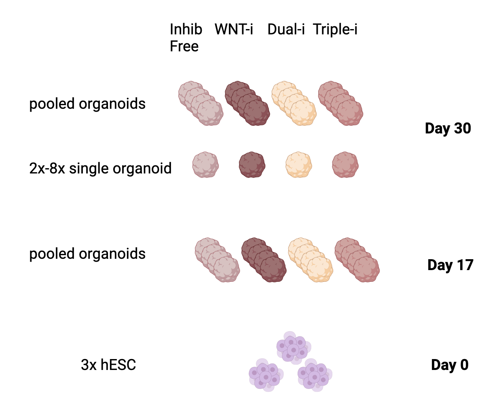

```{r setup, include=FALSE}
knitr::opts_chunk$set(echo = TRUE)
```

## Introduction

### About the paper
The following details early pre-processing steps of the GEO dataset associated with the publication: [Enhanced cortical neural stem cell identity through short SMAD/WNT inhibition in human cerebral organoids facilitates emergence of outer radial glial cells.](https://www-ncbi-nlm-nih-gov.myaccess.library.utoronto.ca/geo/query/acc.cgi?acc=GSE189981)

The authors of this paper investigate a novel culture protocol for 3D Brain Organoids which is thought to enhance the emergence of outer radial glia (oRGs). These cells are a vital component involved in cortical expansions.

Here is a schematic of the data:

### Packages

```{r eval = TRUE, message = FALSE}
# Install Bioconductor
if (!requireNamespace("BiocManager", quietly = TRUE))
    install.packages(BiocManager)

# Install openxlsx
if (!requireNamespace("openxlsx", quietly = TRUE))
     install.packages("openxlsx", dependencies = TRUE)

# Install GEOquery
if (!requireNamespace("GEOquery", quietly = TRUE))
    BiocManager::install(GEOquery)

# Install biomaRt
if (!requireNamespace("biomaRt", quietly = TRUE))
    BiocManager::install("biomaRt")

# Install data.table
if (!requireNamespace("data.table", quietly = TRUE))
    install.packages("data.table")

# Install edgeR
if (!requireNamespace("edgeR", quietly = TRUE))
    BiocManager::install("edgeR")
```

## Accessing the Data

### GEO dataset
```{r eval = TRUE, message = FALSE}
#Store GEO ID
geoid <-"GSE189981"
#Access GEO dataset
gse <- GEOquery::getGEO(geoid, GSEMatrix = FALSE)
```

### Platform
```{r eval=TRUE, message = FALSE}
#Investigate dataset platform and output info
gpl <- names(GEOquery::GPLList(gse))[1]
gpl_info <- GEOquery::Meta(GEOquery::getGEO(gpl))
```
**Platform title:** `r gpl_info$title` 
An Illumina HiSeq 2500 was used to sequence the Bulkseq data.  

**Submission date:** `r gpl_info$submission_date` 

**Last Update:** `r gpl_info$last_update_date`

**Organism:** `r gpl_info$organism`

**Number of GEO datasets using this platform:** `r length(gpl_info$series_id)`


### Supplementary Files
```{r eval = TRUE, message = FALSE, tidy=TRUE}

#Check Supplementary file
filenames <- GEOquery::getGEOSuppFiles(geoid,fetch_files = FALSE)
bulkseq_filename <- filenames$fname[3]

#Store path to Bulkseq file 
file_location <- file.path(getwd(),geoid,bulkseq_filename)
```
Pre-processed Bulkseq data is stored in a Bulkseq excel file as RPKM. 

### Loading Data Files
```{r eval = TRUE, message = FALSE}

# Bulkseq file loading if not already downloaded then loaded
if (!file.exists(file_location)) {
  # Fetching file from GEO if it doesn't exist 
  GEOquery::getGEOSuppFiles(geoid,
                  filter_regex = bulkseq_filename,
                  baseDir = getwd(),
                  fetch_files = TRUE)
} else if (!exists("bulkseq_data")) {
  # Loading file as object if not loaded
  raw_bulkseq_data <- as.data.frame(openxlsx::read.xlsx(file_location, 
                             colNames = FALSE,
                             fillMergedCells = TRUE))

} else (print("File already loaded"))
  

```

## Preprocessing
### Sample Information  
```{r eval = TRUE, message = FALSE}

# Storing list of samples
list_of_samples <- gse@gsms

# Converting the list of samples into a dataframe and cleaning
samples_info <- do.call(rbind, lapply(list_of_samples, function(x) {
  # For every element in the list pull sample info into data frame
  data.frame(
    SampleName = x@header$title,
    # Clean up information in every column to remove extra words
    CellLine = sub("cell line: ", "", x@header$characteristics_ch1[1]),
    Protocol = sub("protocol: ", "", x@header$characteristics_ch1[2]),
    Age = sub("age: ", "", x@header$characteristics_ch1[3]),
    CellType = sub("cell type: ", "", x@header$characteristics_ch1[4])
  )
  }
  ))

# Only select Bulkseq samples (H9 cell line) which are Wildtype
WT_bulk_sample_info <- samples_info[which
                                 (samples_info[,"CellLine"] == "H9"),]

kableExtra::kable_styling(knitr::kable(head(WT_bulk_sample_info)))


```

### Cleaning Column Names
```{r eval=TRUE, message=FALSE}
# Merging column names
merged_colnames <- sapply(raw_bulkseq_data[1:3,], function(x) paste(x,collapse = " "))

#Clean list to use as reference when cleaning my column names 
#This can also serve as a legend.
clean_labels <- list(
  "hgnc" = "HGNC",
  "hESCs" = "hESCs",
  "SINGLE" = "SI",
  "POOLED" = "PL",
  "Wildtype" = "WT",
  "Day 17" = "D17",
  "Day 30" = "D30",
  "WNT-i" = "WNT",
  "Triple-i" = "Triple",
  "Dual SMAD-i" = "Dual",
  "Inhibitor-free" = "IF",
  "Microcephaly" = "rmv")

#Cleaning column names by extracting necessary information
clean_colnames <- sapply(merged_colnames, function(x) {
  #Initialize my clean column names vector
  clean_colnames <- ""
  for (i in names(clean_labels)) {
    #For every entry in my "dirty" colnames list
    #I am checking it against sequences in the clean labels to grab experimental identifiers
    if ((grepl(i, x))==TRUE) {
      #Clean labels are appended to new colnames object 
      clean_colnames <- paste(clean_colnames, sep = "_", clean_labels[[i]])
    }
  }
  #Removing any white space
  return(trimws(clean_colnames, whitespace = "_"))
  })

#Assigning colnames to my data and removing the old "column name" rows.
colnames(raw_bulkseq_data) <- c(clean_colnames)
bulkseq_data <- raw_bulkseq_data[-(1:3),]

#View legend
legend <- t(as.data.frame(clean_labels))
kableExtra::kable_styling(knitr::kable(legend, 
             col.names = c("Old Identifier", "Column Label")))

#View new column names
kableExtra::kable_styling(knitr::kable(head(bulkseq_data)))
```
**Current Data Dimensions:** `r dim(bulkseq_data)`  
The data dimensions roughly align with the expected number of genes.

**Unique Identifier:** `r length(unique(bulkseq_data[,1]))-3`

**Duplicated Identifier:** `r (length(bulkseq_data[,1]) - length(unique(bulkseq_data[,1])))`

### Removing duplicates
```{r eval=TRUE, message=FALSE}
#Separate duplicated and unmapped genes from main dataframe
duplicated_unmapped <- bulkseq_data[-(grep("[A-Za-z]",bulkseq_data$HGNC)),]

# Removing 2 duplicated entries
duplicated_genes <- duplicated_unmapped$HGNC[duplicated(duplicated_unmapped$HGNC)]
unmapped <- duplicated_unmapped[-(grep(paste(duplicated_genes,collapse = "|"),
                                       duplicated_unmapped$HGNC)),]
```

### Mapping identifier
```{r eval=TRUE, message=FALSE}

# Get ensembl mart object
ensembl<- biomaRt::useMart("ensembl", dataset = "hsapiens_gene_ensembl")

# Save ensembl attributes and filters
ensembl_attributes <- biomaRt::listAttributes(mart = ensembl, what = c("name","description"))
ensembl_filters <- biomaRt::listFilters(mart = ensembl, what = c("name","description"))

# Check for HGNC related ensembl attributes
hgnc_attributes <- ensembl_attributes[grepl("hgnc",ensembl_attributes$name),]
hgnc_filters <- ensembl_filters[grepl("hgnc",ensembl_filters$name),]

# Get my unmapped hgnc ids and add HGNC: for filtering
hgnc_ids <- unmapped$HGNC
hgnc_ids<- sapply(hgnc_ids, function(x) paste("HGNC:",x,sep = ""))

# Grab HGNC symbols based on HGNC ids
hgnc_symbols <- biomaRt::getBM(attributes = c('hgnc_id', 'hgnc_symbol'),
                 filters = 'hgnc_id',
                 values = hgnc_ids,
                 mart = ensembl)

kableExtra::kable_styling(knitr::kable(hgnc_symbols))

# Strip HGNC ids to allow merging back
hgnc_symbols[1] <-sapply(hgnc_symbols[1], function(x) gsub("HGNC:","",x))

# Rename columns to match unmapped 
hgnc_symbols <-as.matrix(hgnc_symbols)
colnames(hgnc_symbols) <- c("HGNC", "Symbol")
hgnc_symbols <-as.data.frame(hgnc_symbols)

# Subset out unmappable genes
mapped <- subset(unmapped, HGNC %in% hgnc_symbols$HGNC)
# Merge symbols back to unmapped genes to create mapped genes
mapped <- merge(mapped, hgnc_symbols, by = "HGNC", all = TRUE)
```
**How Many Identifiers did not map/were removed:** `r length(unmapped$HGNC)-length(mapped$HGNC)`

### Merging duplicated/unmapped subset 
```{r eval=TRUE, message=FALSE}
# Order symbols at the beginning of dataframe and remove old HGNC Ids
mapped_ordered <- mapped[,c(53,2:52)]

# Rename Symbol to HGNC to prepare for rbind
colnames(mapped_ordered) <- colnames(bulkseq_data)

# Remove the old unmapped genes from the original dataset 
bulkseq_data <- bulkseq_data[grep("[A-Za-z]",bulkseq_data$HGNC),]

# Combine mapped genes with original dataset
bulk_data <- rbind(bulkseq_data,mapped_ordered)

# Remove final duplicate gene with 0 expression
bulk_data <- bulk_data[(bulk_data$HGNC != "PHGR1"),]

# Make Gene Symbols rownames and remove redundant column
rownames(bulk_data) <- bulk_data$HGNC
bulk_data <- bulk_data[,-1]

kableExtra::kable_styling(knitr::kable(head(bulk_data)))

```
**Current data dimension:** `r dim(bulk_data)`

### Extracting relevant experiments
```{r eval=TRUE, message=FALSE}
#Removing Microcephaly table which was tagged with rmv
bulk_data <- bulk_data[,-c((grep("rmv",(colnames(bulkseq_data)))))]
```

**Current data dimension:** `r dim(bulk_data)`

### Data Stratification
```{r eval=TRUE, message=FALSE}
# Checking how the data is stratified
sample_info_dt <- data.table::data.table(WT_bulk_sample_info)
sample_info_dt[, .(count = .N), by = sample_info_dt$Protocol]
sample_info_dt[, .(count = .N), by = sample_info_dt$Age]
```

### Removing low expressed and non-expressed genes
```{r eval=TRUE, message=FALSE}
# Min samples of 10 corresponds to 10 samples/culture condition
min_num_samples <- 15
# Remove low counts
keep_bulk <- rowSums(bulk_data >1) > min_num_samples
filtered_bulk_data <- bulk_data[keep_bulk,]
```

### Pre-Normalization Density plots
```{r}
# Get numerical data and log transform it
filt_bulk_data_num <- sapply(filtered_bulk_data[,1:37], function(x) as.double(x))
filt_data2plot <- log2(filt_bulk_data_num)

unfilt_bulk_data_num <- sapply(bulk_data[,1:37], function(x) as.double(x))
unfilt_data2plot <-log2(unfilt_bulk_data_num)
```

```{r}
filt_counts_density <- apply(filt_data2plot, 2, density)
unfilt_counts_density <- apply(unfilt_data2plot, 2, density)

# Calculate axis limits
xlim <- 0; ylim <- 0
for (i in 1:length(filt_counts_density)) {
  xlim <- range(c(xlim, filt_counts_density[[i]]$x));
  ylim <- range(c(ylim, filt_counts_density[[i]]$y))
}
cols <- rainbow(length(filt_counts_density))
ltys <- rep(1, length(filt_counts_density))
# Plot the first density plot followed by the lines
plot(filt_counts_density[[1]], xlim=xlim, ylim=ylim, type="n",
     ylab="Smoothing density of log2-RPKM",
     main="Filtered log2RPKM Density", cex.lab = 0.85)
# Plot each line
for (i in 1:length(filt_counts_density))
  lines(filt_counts_density[[i]], col=cols[i], lty=ltys[i])
#Create legend
legend("topright", colnames(filt_data2plot),
       col=cols, lty=ltys, cex=0.3,
       border ="blue", text.col = "black",
       merge = TRUE, bg = "gray95")

# Second Plot for unfiltered for comparison
xlim <- 0; ylim <- 0
for (i in 1:length(unfilt_counts_density)) {
  xlim <- range(c(xlim, unfilt_counts_density[[i]]$x));
  ylim <- range(c(ylim, unfilt_counts_density[[i]]$y))
}
cols <- rainbow(length(unfilt_counts_density))
ltys <- rep(1, length(unfilt_counts_density))
# Plot the first density plot followed by the lines
plot(unfilt_counts_density[[1]], xlim=xlim, ylim=ylim, type="n",
     ylab="Smoothing density of log2-RPKM",
     main=" Unfiltered log2RPKM Density", cex.lab = 0.85)
# Plot each line
for (i in 1:length(unfilt_counts_density))
  lines(unfilt_counts_density[[i]], col=cols[i], lty=ltys[i])
#Create legend
legend("topright", colnames(unfilt_data2plot),
       col=cols, lty=ltys, cex=0.3,
       border ="blue", text.col = "black",
       merge = TRUE, bg = "gray95")

```

### Pre-normalization boxplots
```{r eval=TRUE, message=FALSE, warning=FALSE}

boxplot(filt_data2plot, xlab = "Samples", ylab = "log2 RPKM",
        las = 2, cex = 0.5, cex.lab = 0.5,
        cex.axis = 0.5, main = "Filtered Log2RPKM")
# Median line
abline(h = median(apply(filt_data2plot, 2, median)),
       col = "red", lwd = 0.6, lty = "dashed")


boxplot(unfilt_data2plot, xlab = "Samples", ylab = "log2 RPKM",
        las = 2, cex = 0.5, cex.lab = 0.5,
        cex.axis = 0.5, main = "Unfiltered Log2RPKM")
# Median line
abline(h = median(apply(unfilt_data2plot, 2, median)),
       col = "red", lwd = 0.6, lty = "dashed")
```

## Normalization
### Normalization with edgeR
```{r eval=TRUE, message=FALSE}

d <- edgeR::DGEList(counts = filt_bulk_data_num, group = WT_bulk_sample_info$Protocol)

d <- edgeR::calcNormFactors(d)

normalized_counts <-  edgeR::cpm(d)

log2_normalized_counts <- log2(normalized_counts)
```

### Post-Normalization density and Boxplots
```{r eval=TRUE, message=FALSE, warning=FALSE}

normal_count_density <- apply(log2_normalized_counts, 2, density)

boxplot(log2_normalized_counts, xlab = "Samples", ylab = "log2 RPKM",
        las = 2, cex = 0.5, cex.lab = 0.5,
        cex.axis = 0.5, main = "Normalized log2CPM")
# Median line
abline(h = median(apply(log2_normalized_counts, 2, median)),
       col = "red", lwd = 0.6, lty = "dashed")


# Density plot for normalized data
xlim <- 0; ylim <- 0
for (i in 1:length(normal_count_density)) {
  xlim <- range(c(xlim, normal_count_density[[i]]$x));
  ylim <- range(c(ylim, normal_count_density[[i]]$y))
}
cols <- rainbow(length(normal_count_density))
ltys <- rep(1, length(normal_count_density))

plot(normal_count_density[[1]], xlim=xlim, ylim=ylim, type="n",
     ylab="Smoothing density of log2-RPKM",
     main=" Normalized log2CPM Density", cex.lab = 0.85)

for (i in 1:length(normal_count_density))
  lines(normal_count_density[[i]], col=cols[i], lty=ltys[i])

legend("topright", colnames(log2_normalized_counts),
       col=cols, lty=ltys, cex=0.3,
       border ="blue", text.col = "black",
       merge = TRUE, bg = "gray95")
```
## Final Dataframe
```{r}

final_df <- normalized_counts
rownames(final_df) <- rownames(filtered_bulk_data)
  
kableExtra::kable_styling(knitr::kable(head(final_df)))
```

## Questions
**1. Why is the dataset of interest to you?**

The past few years of research have grown my interest in outer radial glia (oRGs), a primate neural precursor involved in cortical expansion. oRG abnormality is thought to underly a large number of Neurodevelopmental disorders (NDDs) such as Autism Spectrum Disorder. We've only just started studying these cells recently (relative to other cells) and so the potential implications for our understanding of human cognition, development and potential applications are quite exciting. 

This study and dataset are particularly interesting to me because of my work with brain organoids. oRGs are quite difficult to culture and they can take up 100 days to appear in 2D culture. In both 3D and 2D cultures, oRG emergence is very variable which restricts reproducibility. This triple inhibition protocol (which I am currently testing in the lab) purports to enhance oRG emergence. I'm curious as to the underlying transcriptomics which may drive the function of this new protocol. 

**2. What are the control and test conditions of the dataset?**

The [controls of this dataset](#sample-information) are day 0 undifferentiated human embryonic stem cells (hESCs). The test conditions compared against these stem cells will be brain organoids grown under 4 different protocols: Inhibitor free, WNT-i, Dual SMAD-i or Triple-i. The "i" in this case, denotes inhibition, whereby the inhibition of specific morphogens can help us fine tune and guide cell development. The secondary condition being examined is time. Day 0 hESCs are compared to all protocols at Day 17 and Day 30 to assess the progression of oRG emergence. All organoids for bulk RNAseq were generated rom the same H9 cell line.

**3. How many samples in each of the conditions of your dataset?**

[Sample distribution can be seen here:](#data-stratification)

One interesting feature of this dataset is that some samples are pooled organoids, while others are single organoids. 

**4. Were there expression values that were not unique for specific genes? How did you handle these?**

Genes with 0 expression values in more than 15 samples were completely removed. Otherwise all expression values appeared unique.

**5. Were there expression values that could not be mapped to current HUGO symbols?**

[Mapping was performed here](#mapping-identifier)
This data set did have HUGO symbols already, so most of the work was done for me. However, ~27/18746 genes did not have a HUGO symbol and instead had numerical HUGO ids. 4 of those genes were the duplicate which meant that 23 genes needed to be mapped. Using biomaRt, I mapped an additional 14 genes. This left me with 9 genes which did not have a HUGO gene entry and could not be verified. To avoid inaccurate mapping, those genes were removed.

Therefore, in handling duplicates and unmapped rows, I removed 12 genes in total out of 18746.

**6. Were there any outliers in your dataset? How were they handled in the originating paper? How many outliers were removed?**

This dataset has already been normalized to RPKM and so outliers were already removed. This can be seen in the similarity between filtered and normalized boxplots. The authors did not specify their process for removing outliers.

**7. How did you handle replicates?**

[*Duplicates?*](#removing-duplicates)
There were only 3 duplicated genes in the entire dataset. One gene had 0 expression so that was removed without consideration. The other 2 genes were researched to see if I could differentiate between the two rows given they varied in expression. I was unable to find splice variants or an explanation for either, so I chose to omit those genes as well as to not bias their expression by summing/averaging. Therefore, a total of 6 (3x2) duplicate genes were removed.

*Replicates?*
The single organoid samples all had a range between 2-8 replicates. I did not process these yet as I am still deciding the best approach for analyzing them in comparison to the pooled organoids.

**8. What is the final coverage of your dataset?**
The final dataset has `r dim(normalized_counts)[1]` genes and `r dim(normalized_counts)[2]` samples.
Note: The authors chose to only include samples with Refseq annotations.

## References
1. Rosebrock D, Arora S, Mutukula N, Volkman R, Gralinska E, Balaskas A, et al. Enhanced cortical neural stem cell identity through short SMAD and WNT inhibition in human cerebral organoids facilitates emergence of outer radial glial cells. Nat Cell Biol. 2022;24(6):981–95.  

2. Huber W, Carey VJ, Gentleman R, Anders S, Carlson M, Carvalho BS, Bravo HC, Davis S, Gatto L, Girke T, Gottardo R, Hahne F, Hansen KD, Irizarry RA, Lawrence M, Love MI, MacDonald J, Obenchain V, Oleś AK, Pagès H, Reyes A, Shannon P, Smyth GK, Tenenbaum D, Waldron L, Morgan M. Orchestrating high-throughput genomic analysis with Bioconductor. Nature Methods. 2015;12(2):115–121. 

3. Schauberger P, Walker A. openxlsx: Read, Write and Edit xlsx Files. R package version 4.2.5.2. 2023. 

4. Davis S, Meltzer P. GEOquery: a bridge between the Gene Expression Omnibus (GEO) and BioConductor. Bioinformatics. 2007;14:1846–1847.

5. Durinck S, Spellman PT, Birney E, Huber W. Mapping identifiers for the integration of genomic datasets with the R/Bioconductor package biomaRt. Nature Protocols. 2009;4:1184–1191.

6. Barrett T, Dowle M, Srinivasan A. data.table: Extension of data.frame. R package version 1.14.10. 2023. Available from: https://CRAN.R-project.org/package=data.table

7. Robinson MD, McCarthy DJ, Smyth GK. edgeR: a Bioconductor package for differential expression analysis of digital gene expression data. Bioinformatics. 2010;26(1):139-140.

8. Kriegstein A, Noctor S, Martínez-Cerdeño V. Patterns of neural stem and progenitor cell division may underlie evolutionary cortical expansion. Nat Rev Neurosci. 2006 Nov;7(11):883–90.

9. Pollen AA, Nowakowski TJ, Chen J, Retallack H, Sandoval-Espinosa C, Nicholas CR, et al. Molecular Identity of Human Outer Radial Glia During Cortical Development. Cell. 2015 Sep 24;163(1):55–67.

10. Camp JG, Badsha F, Florio M, Kanton S, Gerber T, Wilsch-Bräuninger M, et al. Human cerebral organoids recapitulate gene expression programs of fetal neocortex development. Proceedings of the National Academy of Sciences. 2015 Dec 22;112(51):15672–7. 


