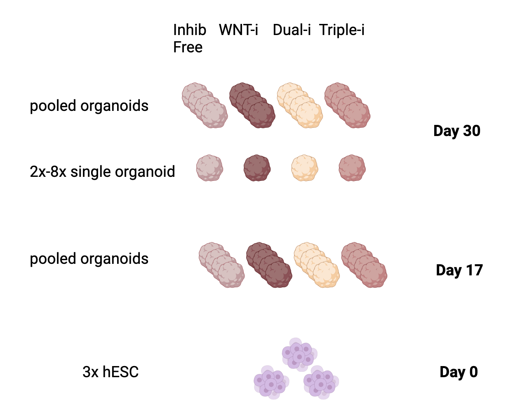

```{r setup, include=FALSE}
knitr::opts_chunk$set(echo = TRUE)
```

## Introduction

### About the paper

The following details early pre-processing steps of the GEO dataset associated with the publication: [Enhanced cortical neural stem cell identity through short SMAD/WNT inhibition in human cerebral organoids facilitates emergence of outer radial glial cells.](https://www.ncbi.nlm.nih.gov/geo/query/acc.cgi?acc=GSE189981)

The authors of this paper investigate a novel culture protocol for 3D Brain Organoids which is thought to enhance the emergence of outer radial glia (oRGs). These cells are a vital component involved in cortical expansions and have been implicated in a variety of neurdevelopmental disorders (NDDs). Feel free to read more here: [Molecular identity of human outer radial glia during cortical development.](https://pubmed.ncbi.nlm.nih.gov/26406371/).


### Recap of Assignment 1
In assignment 1, I worked to clean, organize and normalize my data. The data was in an excel file as RPKM and was downloaded from [GEO, accesion number: GSE189981](https://www.ncbi.nlm.nih.gov/geo/query/acc.cgi?acc=GSE189981). the inital bulk sequencing table had multiple column headings denoting the various conditions and cell lines. I cleaned up the headers in that matrix and aligned them with the headers in the sample information table. The genes were already denoted as HGNC, however a few gene symbols were missing. I was able to map 14 additional genes and eliminated 9 unmappable genes. From there, I normalized my data, and verified my normalization with density plots and boxplots. This final, normalized, clean dataframe is my input for this Assignment, alongside a sample information dataframe.

### The data

This dataset has 37 samples in total which vary by age and culture protocol. The ages are **Day 0** (control, n=3), **Day 17** (n=4), **Day 30** (n = 30). Given the low number of day 17 samples and that the main interest is in comparing protocols, I excluded the day 17 datapoints. There are 5 protocols being compared in this study hESC (controls), **Inhibitor Free (IF)**, **WNT inhibition (WNT)**, **Dual SMAD inhibition (Dual)**, and **Triple Inhibition (Triple)**.

Here is a schematic of the data:


### Load Required Packages

```{r eval=TRUE, message=FALSE, warning=FALSE}

# Install Bioconductor
if (!requireNamespace("BiocManager", quietly = TRUE))
    install.packages(BiocManager)

# Install edgeR
if (!requireNamespace("edgeR", quietly = TRUE))
    BiocManager::install("edgeR")

# Install ggplot2
if (!requireNamespace("ggplot2", quietly = TRUE))
    install.packages("ggplot2")

# Install ComplexHeatmap
if (!requireNamespace("ComplexHeatmap", quietly = TRUE))
    install.packages("ComplexHeatmap")

# Install Circlize
if (!requireNamespace("circlize", quietly = TRUE))
    install.packages("circlize")

# Install VennDiagram
if (!requireNamespace("VennDiagram", quietly = TRUE))
    install.packages("VennDiagram")

# Install gprofiler2
if (!requireNamespace("gprofiler2", quietly = TRUE))
    install.packages("gprofiler2")

# Install ggrepel
if (!requireNamespace("ggrepel", quietly = TRUE))
    install.packages("ggrepel")

#Load packages 
library(ggplot2)
library(VennDiagram)
library(circlize)
library(ComplexHeatmap)
library(edgeR)
library(gprofiler2)
library(ggrepel)
library(dplyr)
```

### Load data from Assignment 1

```{r eval=TRUE, message=FALSE, warning=FALSE}
#Load past data including
#Normalized dataframe
normal_data <- readRDS("normalized_counts.rds")

#Sample info
sample_info <- readRDS("sampleinfo.RDS")

# Remove day 17 timepoints
normal_data <- normal_data[,-c(4:7)]
sample_info <- sample_info[-c(4:7),]

```

## Variance Analysis

### Initialize edgeR object, design matrix and palette
```{r eval=TRUE, message=FALSE, warning=FALSE, fig.cap= "Table 1.Design Matrix"}
#create edgeR DGEList object
organoidDGE <- DGEList(counts=as.matrix(normal_data), 
             group=sample_info$Protocol)

protocols <- sample_info$Protocol

protocol_colors <- setNames(c("darkred", "blue4", "pink", "darkgreen", "darkgoldenrod1"), 
                            unique(protocols))

# Set hESC controls as reference
sample_info$Protocol <- as.factor(sample_info$Protocol)
sample_info$Protocol <- relevel(sample_info$Protocol, ref = "hESCs")

#Create design matrix based on Protocol
design_matrix <- model.matrix(~ sample_info$Protocol)
colnames(design_matrix) <- gsub("sample_info$Protocol","",colnames(design_matrix), fixed = TRUE)
colnames(design_matrix) <- gsub(" ","_",colnames(design_matrix), fixed = TRUE)
colnames(design_matrix) <- gsub("-","",colnames(design_matrix), fixed = TRUE)

# Check design matrix 
kableExtra::kable_styling(knitr::kable(head(design_matrix)))
```


### Multidimensional scaling plots

The MDS plots show data the clustering of the various data points. It's quiet clear that the clustering by age results in a significant shift. This is expected since the expression difference between organoids and embyonic stem cells is significant. The clustering across the protocols is more interesting as it shows that some protocols, like Triple and Dual, cluster much more closely. Meanwhile more unguided protocols like the IF and WNT guide sporadically. 

```{r eval=TRUE, message=FALSE, warning=FALSE, fig.cap= "Figure 2. MDS plot of organoids by A) Protocol and B) Age"}
# Plot MDS plot for protocol
plotMDS.DGEList(organoidDGE, 
        labels=NULL, 
        pch = 16, 
        col = protocol_colors[
          factor(sample_info$Protocol)])  

# Add legend and Title to Protocol MDS
title(main = "A)  MDS Plot by Protocol")
legend("topleft", 
       legend = levels(factor(sample_info$Protocol)),
       col = protocol_colors, 
       pch = 16, 
       cex = 0.75,
       title = "Protocols")

# Plot MDS plot for Age
plotMDS.DGEList(organoidDGE, 
        labels=NULL, 
        pch = 16, 
        col = protocol_colors[
          factor(sample_info$Age)])  

# Add legend and Title to Age MDS
title(main = "B)  MDS Plot by Age")
legend("topleft", 
       legend = levels(factor(sample_info$Age)),
       col = protocol_colors, 
       pch = 16, 
       cex = 0.75,
       title = "Age")
```


### Dispersion estimation
```{r eval=TRUE, message=FALSE, warning=FALSE}

# Estimate dispersion
organoidDGE <- estimateDisp(organoidDGE, design_matrix)

# Obtain dispersion and biological variation values 
organoidDGE <- estimateGLMCommonDisp(organoidDGE, design_matrix)
```
**Dispersion:** `r organoidDGE$common.dispersion` 

**BCV:** `r sqrt(organoidDGE$common.dispersion)` 


## Differential Expression Analysis
### Negative binomial generalized linear model 

```{r eval=TRUE, message=FALSE, warning=FALSE}

# Fit GLM
organoid_fit <- glmQLFit(organoidDGE, design_matrix)

# Dual SMAD-i differential expression
qlf.Dual <- glmQLFTest(organoid_fit, coef=2)

Dual_hits <- topTags(qlf.Dual,
                     sort.by = "PValue",
                     adjust.method = "BH",
                     n = nrow(organoidDGE))

# Inhibitor-free differential expression
qlf.IF <- glmQLFTest(organoid_fit, coef=3)

IF_hits <- topTags(qlf.IF,
                   sort.by = "PValue",
                   adjust.method = "BH",
                   n = nrow(organoidDGE))

#Triple-i differential expression
qlf.Triple <- glmQLFTest(organoid_fit, coef=4)

Triple_hits <- topTags(qlf.Triple,
                       sort.by = "PValue",
                       adjust.method = "BH",
                       n = nrow(organoidDGE))

#  WNT differential expression
qlf.WNT <- glmQLFTest(organoid_fit, coef=5) 
          
WNT_hits <- topTags(qlf.WNT,
                    sort.by = "PValue",
                    adjust.method = "BH",
                    n = nrow(organoidDGE))

```


### Statistical summary

1. P-values were calculated using topTag function in edgeR. The number of significantly expressed genes can be viewed below in table 2 and varies by the protocol. The range for the number of significant genes was 7704 to 8427 P-value cut off was placed at a stirngent P < 0.01 given the large number of differentially expressed genes.

2. Benjamini and Hochberg (BH) correction was used for multiple hypothesis testing. This method was used given that it's a simplified yet robust approach to multiple hypothesis testing, with widespread use throughout many scientific settings.
BH correction controls for the false discovery rate, ensuring that the probability of at least one false positive remains low. The number of genes passing correction based on the protocol is seen below in Table 2. To summarize 7151 (Dual), 7446 (IF), 6754 (WNT) and 7988 (Triple) genes passed.

```{r eval=TRUE, message=FALSE, warning=FALSE, fig.cap= "Table 2. Summary of Significnat and Corrected (BH) number of differentially expressed genes" }

# Table summarizing number of genes which pass statistical testing and 
# correction for each protocol
hit_summary_table <- data.frame(
  Category = c("Dual", "IF", "WNT", "Triple"),
  Significant = c(nrow(Dual_hits$table[which(Dual_hits$table$PValue < 0.01),])
                  , nrow(IF_hits$table[which(IF_hits$table$PValue < 0.01),])
                  ,nrow(WNT_hits$table[which(WNT_hits$table$PValue < 0.01),]),
                  nrow(Triple_hits$table[which(Triple_hits$table$PValue < 0.01),])),
  Corrected = c(nrow(Dual_hits$table[which(Dual_hits$table$FDR < 0.01),])
                ,nrow(IF_hits$table[which(IF_hits$table$FDR < 0.01),])
                ,nrow(WNT_hits$table[which(WNT_hits$table$FDR < 0.01),]),
                nrow(Triple_hits$table[which(Triple_hits$table$FDR < 0.01),]))
)

# Show the table
kableExtra::kable_styling(knitr::kable(hit_summary_table,
                                       caption = "Significant and Corrected Gene Counts"))

```

### Volcano plots
3. Volcano plots showing differential expressed genes for every protocol are shown below Upregulated genes include PCDHGB4 and PCDHGC3,important factors for synaptic formation, and ZNF521 gene expressedin neural progeneitors. Downregulated genes include genes connected to embryonic stem cell maintenance such as POU5F1 (AKA OCT4) and TDGF1. This is consistent with organoid formation from hESCs.

```{r eval=TRUE, message=FALSE, warning=FALSE, fig.cap="Figure 3. Volcano plots displaying differentially upregulated and downregulated genes by organoid induction protocol. A)Dual Inhibition B) Inhibitor free C)Triple Inhibition D)WNT Inhibition"}

# Function to make volcano plots for all the protocols
create_volcano_plot <- function(data,title) {
  data$direction <- with(data, ifelse(logFC > 1 & FDR < 0.01, "Upregulated",
                                      ifelse(logFC < -1 & FDR < 0.01, "Downregulated", "None")))
  top_genes <- data %>%
    arrange(FDR, abs(logFC)) %>%
    slice_head(n= 5, by = direction)
  
  ggplot(data, aes(x = logFC, y = -log10(FDR), color = direction)) +  
    geom_point(alpha = 0.5) + 
    theme_linedraw()+
    labs(title = paste(title, "DEGs"), x = "Log Fold Change", y = "-log10(FDR)") +
    scale_color_manual(values = c("Upregulated" = "darkred", "Downregulated" = "darkblue", "None" = "darkgrey"))+
    theme(legend.title = element_blank())+
    geom_vline(xintercept = c(-1,1), linetype = "longdash", color = "black", linewidth = .4) +
    geom_hline(yintercept = -log10(0.01), linetype = "longdash", color = "black", linewidth = .4)+
    geom_text_repel(data = top_genes, aes(label = rownames(top_genes)), size = 3, nudge_y = 5) 

}

create_volcano_plot(Dual_hits$table, "A)Dual Inhibition")
create_volcano_plot(IF_hits$table, "B) Inhibitor Free")
create_volcano_plot(Triple_hits$table, "C)Triple Inhibition")
create_volcano_plot(WNT_hits$table, "D) WNT Inhibition")
```


### Top hits subsets and gene lists
I filtered for top hits which had an FDR <0.01 and a logFC greater than 1 or less than -1. This would ensure a strong threshold for detecting differential expression.
```{r eval=TRUE, message=FALSE, warning=FALSE}

# Filter for top hits and get top hit gene name lists

# Dual Inhibition
top_Dual <-Dual_hits$table[which((Dual_hits$table$logFC > 1 |
                                               Dual_hits$table$logFC < -1) & 
                                               Dual_hits$table$FDR < 0.01),]
top_Dual_names <- rownames(top_Dual)

# Inhibitor Free
top_IF <- IF_hits$table[which((IF_hits$table$logFC > 1 |
                                            IF_hits$table$logFC < -1) &
                                            IF_hits$table$FDR < 0.01),]
top_IF_names <- rownames(top_IF)

# Triple Inhibition
top_Triple <-Triple_hits$table[which((Triple_hits$table$logFC > 1 |
                                                   Triple_hits$table$logFC < -1) &
                                                   Triple_hits$table$FDR < 0.01),]
top_Triple_names <- rownames(top_Triple)

# WNT Inhibition
top_WNT <- WNT_hits$table[which((WNT_hits$table$logFC > 1 | 
                                              WNT_hits$table$logFC < -1 ) &
                                              WNT_hits$table$FDR < 0.01),]
top_WNT_names <- rownames(top_WNT)
```


### Protocol Combined and Unique hits
The top hits include all the protocols in comparison to the control, I will use that initially for my heatmap. But I also I need a way to asses inter-protocol differential expression. To do this, I'm assessing which protocols have unique differential expression genes (DEGs) that don't overlap with any other DEGs.

```{r eval=TRUE, message=FALSE, warning=FALSE}

# Combined list of top hits for all protocols (for heatmap)
top_combined_names <- union(top_WNT_names,union(top_Triple_names,union(top_Dual_names,top_IF_names)))

# Unique lists of top hits for all protocols
unique_Dual <- setdiff(top_Dual_names,union(top_Triple_names,union(top_IF_names,top_WNT_names)))
unique_IF <- setdiff(top_IF_names,union(top_Triple_names,union(top_Dual_names,top_WNT_names)))
unique_Triple <- setdiff(top_Triple_names,union(top_IF_names,union(top_Dual_names,top_WNT_names)))
unique_WNT <- setdiff(top_WNT_names,union(top_IF_names,union(top_Dual_names,top_Triple_names)))

# Combine the unique gene lists (for heatmap)
unique_combined <- union(unique_WNT,union(unique_Triple,union(unique_Dual,unique_IF)))
```


### Venn Diagram
Venn diagram showing number of unique top hits in each protocol.
```{r eval=TRUE, message=FALSE, warning=FALSE, fig.cap= "Figure 4. Venn Diagram displaying overlapping and unique differentially expressed genes across organoid protocols"}
# Create a list of top hit lists
hit_list <- list("Dual Inhibition" = top_Dual_names, 
                    "Inhibitor Free" = top_IF_names, 
                    "Triple Inhibition" = top_Triple_names, 
                    "WNT Inhibition" = top_WNT_names)

# Initialize venn diagram function which displays venn diagram
make_venn <- function(x,col,title,lty){
  grid::grid.newpage()
  my_venn <- venn.diagram(x, filename = NULL, 
                                           fill = col, 
                                           disable.logging= TRUE, main = title,
                                       lty = lty)
  futile.logger::flog.threshold(futile.logger::ERROR, name = "VennDiagramLogger")
  grid::grid.draw(my_venn)
}

# Call venn diagram function
make_venn(hit_list, 
          protocol_colors[c(1:2,4:5)],
          "Overlapping and Unique Genes between protocols",
          0)
```

### Heatmaps
4. Initial heatmap of all my DEGs across 5 protocols is show below. The hESC control clusters very well given the large difference in expression. Triple and Dual protocols cluster second best, with some outlying samples. The WNT and Inhibitor free protocols cluster the poorest. This is in line with the reasoning being more advanced protocols like Triple-i and Dual SMAD-i. The more active steps taken to guide the organoid through inhibition, the more consistent the organoid will likely be. Conversely, the unguided or minimally guided WNTi and IF organoids are easily influenced by stochasticity.

```{r eval=TRUE, message=FALSE, warning=FALSE, fig.cap= "Figure 5. Heatmaps of A) Gene expression by protocol across all top hits, B) Gene expression by protocol across unqiue top hits to each protocol"}
# Process for creating heatmap
# Subset and scale my normalized count matrix
full_heatmap_matrix <- t(scale(t(normal_data[top_combined_names,])))

# Set colour scale for heatmap
if(min(full_heatmap_matrix) == 0){
  heatmap_col = colorRamp2(c( 0, max(full_heatmap_matrix)),
                           c( "white", "darkred"))
} else {
  heatmap_col = colorRamp2(c(min(full_heatmap_matrix), 0,
                             max(full_heatmap_matrix)), c("blue4", "white", "darkred"))
}

# Create annotation for my heatmap
heatmap_annotations <- HeatmapAnnotation(df = data.frame(Protocol =
                                                                           sample_info$Protocol),
                                                         col = list(Protocol = protocol_colors),
                                                         show_legend = TRUE)


# Make Heatmap
Heatmap(as.matrix(full_heatmap_matrix),
                        top_annotation = heatmap_annotations,
                        cluster_rows = TRUE,
                        show_column_dend = TRUE, 
                        col=heatmap_col,
                        show_column_names =FALSE,
                        show_row_names = FALSE,
                        show_heatmap_legend = TRUE,
                        column_title = ("A) Gene expression of top hits by protocol"))


```

The heatmap of just the unique genes improves the clustering slightly and helps identity the clusters of unique gene expression that characterize organoids from every protocol. 
```{r eval=TRUE, message=FALSE, warning=FALSE, fig.cap= "Figure 5. Heatmaps of A) Gene expression by protocol across all top hits, B) Gene expression by protocol across unqiue top hits to each protocol"}
# Repeat process for unqiue gene subset
# Subset and scale my normalized count matrix by unique gene list
unique_heatmap_matrix <- t(scale(t(normal_data[unique_combined,])))

# Set colour scale for heatmap
if(min(unique_heatmap_matrix) == 0){
  heatmap_col = colorRamp2(c( 0, max(unique_heatmap_matrix)),
                           c( "white", "darkred"))
} else {
  heatmap_col = colorRamp2(c(min(unique_heatmap_matrix), 0,
                             max(unique_heatmap_matrix)), c("blue4", "white", "darkred"))
}

# Generate heatmap
Heatmap(as.matrix(unique_heatmap_matrix),
                        top_annotation = heatmap_annotations,
                        cluster_rows = TRUE,
                        show_column_dend = TRUE, 
                        col=heatmap_col,
                        show_column_names =FALSE,
                        show_row_names = FALSE,
                        show_heatmap_legend = TRUE,
                        column_title = ("B) Gene expression of unqiue hits by protocol"))


```


## Threshold over-representation analysis

1. I used g:Profiler to perform my Threshold over-representation analysis. This is because it is straightforward and easy to implement and trouble shoot, while giving access to the widely used ontology sources. I can then use insights from g:Profiler as a starting point for later analyses which may be more involved.

2. I annotated my from Gene Ontology Biological processes (GO:BP) as well as reactome (REAC) and wikipathways (WP). These are useful annottation sources that cover a wide range of functions and pathways. Specificlyy, GO:BP, REAC and WP would allow me to identify system level processes and cell pathways which are characteristic of organoid formation (ex neurogenesis, or synaptic formation). They are well documented annotation sources with consistent updates.

3. I used a threshold of FDR < 0.05 since this would enable a more robust broad ontology search which might capture more insights without being overwhelming large. I also used logFC values >1 for upregulation and log FC < -1 for downregulation since I was attempting to identify strongly impactful genes.  I had 8 gene sets, one upregulated and one downregulated for the 4 conditions. I used those to initially run a combined analysis with all the upregulated and downregulated DEGs compared to the control. I later rerun this analysis with only the unique DEGs for each protocol.

### Upregulated and Downregulated gene lists
```{r eval=TRUE, message=FALSE, warning=FALSE}

# Get upregulated and downregulated gene lists for:

# Dual
up_Dual <- rownames(Dual_hits$table[which(Dual_hits$table$logFC > 1 &Dual_hits$table$FDR< 0.05),])
down_Dual <- rownames(Dual_hits$table[which(Dual_hits$table$logFC < -1 &Dual_hits$table$FDR < 0.05),])

# Triple
up_Triple <- rownames(Triple_hits$table[which(Triple_hits$table$logFC > 1 &Triple_hits$table$FDR< 0.05),])
down_Triple <- rownames(Triple_hits$table[which(Triple_hits$table$logFC < -1 &Triple_hits$table$FDR < 0.05),])

# WNT
up_WNT <- rownames(WNT_hits$table[which(WNT_hits$table$logFC > 1 & WNT_hits$table$FDR< 0.05),])
down_WNT <- rownames(WNT_hits$table[which(WNT_hits$table$logFC < -1 & WNT_hits$table$FDR < 0.05),])

# IF
up_IF <- rownames(IF_hits$table[which(IF_hits$table$logFC > 1 & IF_hits$table$FDR< 0.05),])
down_IF <- rownames(IF_hits$table[which(IF_hits$table$logFC < -1 & IF_hits$table$FDR < 0.05),])

# Combined to get an upregulated and downregulated gene list 
all_upregulated <- intersect(up_Dual, intersect(up_Triple, intersect(up_WNT,up_IF)))
all_downregulated <- intersect(down_Dual, intersect(down_Triple, intersect(down_WNT,down_IF)))
```

### gProfiler enrichment analysis All organoids

4. The initial g:Profiler analysis was run on all the hits as well as the upregulated and downregulated genes separately. The results are summarized in Table 3 below. Both analyses produced identical results. Moving forward, analyses were combined when possible to streamline the workflow.

```{r eval=TRUE, message=FALSE, warning=FALSE, fig.cap= "Table 3. Summary of upregulated and downregulated pathways thresholded to P<0.05 when g:profiler query is called alone or combined."}
# g:Profiler for upregulated and downregulated separately 
go_upreg <- gost(query = all_upregulated, 
                organism = "hsapiens", 
                significant = TRUE, 
                exclude_iea = TRUE,
                correction_method = "fdr", 
                domain_scope = "annotated", 
                numeric_ns = "", 
                sources = c("GO:BP", "REAC", "WP"))

go_downreg <- gost(query = all_downregulated, 
                organism = "hsapiens", 
                significant = TRUE, 
                exclude_iea = TRUE,
                correction_method = "fdr", 
                domain_scope = "annotated", 
                numeric_ns = "", 
                sources = c("GO:BP", "REAC", "WP"))

# g:Profiler for upregulated and downregulated
go_upreg_downreg <- gost(query = list(Downregulated = all_downregulated, Upregulated = all_upregulated ), 
                organism = "hsapiens", 
                significant = TRUE, 
                exclude_iea = TRUE,
                correction_method = "fdr", 
                domain_scope = "annotated", 
                numeric_ns = "", 
                sources = c("GO:BP", "REAC", "WP"))

# Table summarizing results from 
both_vs_alone_summary <- data.frame(
  Category = c("Upregulated Alone", "Upregulated combined", "Downregulated Alone", "Downregulated combined"),
  "Number of Pathways" = c(nrow(go_upreg$result),
                           nrow(go_upreg_downreg$result[which(go_upreg_downreg$result$query=="Upregulated"),]),
                           nrow(go_downreg$result),
                           nrow(go_upreg_downreg$result[which(go_upreg_downreg$result$query=="Downregulated"),])
))

# Show the table
kableExtra::kable_styling(knitr::kable(both_vs_alone_summary,
                                       caption = "Summary of upregulated and downregulated pathways"))

```


### Results All organoid enrichment
The top 10 upregulated and downregulated pathways and processes can be seen below. Downregulated pathways indicate core level cellular functions while the upregulated pathways mostly tie to neurodevelopment and neurogenesis.This will be further interpreted at the end of this document.

```{r eval=TRUE, message=FALSE, warning=FALSE, fig.cap= "Table 4. Top 10 A) upregulated and B) downregulated pathways"}

# Filtering and separating upregulated and downregulated gene ontology
# Note* The 1000 term cut off was used since lower thresholds like 200 greatly reduced the tags characteristic of brian organoid formation (ex neurogenesis)
filtered_go_upreg <- go_upreg_downreg$result[which(go_upreg_downreg$result$query == "Upregulated" &
                                                     go_upreg_downreg$result$term_size <= 1000 ),]

filtered_go_downreg <- go_upreg_downreg$result[which(go_upreg_downreg$result$query == "Downregulated" &
                                                       go_upreg_downreg$result$term_size <= 1000 ),]

# Tables to view summary
kableExtra::kable_styling(knitr::kable(filtered_go_upreg[1:10,c(11,10,3,1)], 
                                       caption = "A) Top 10 upregulated pathways",
                                       col.names = c("Term Name", "Source","P Value (BH) ","Direction")))

kableExtra::kable_styling(knitr::kable(filtered_go_downreg[1:10,c(11,10,3,1)], 
                                       caption = "B) Top 10 downregulated pathways",
                                       col.names = c("Term Name", "Source","P Value (BH) ","Direction")))
```


### gProfiler enrichment analysis By protocol
Here, I repeat the gprofiler query but using the individual DEGs for each protocol. This will allow me to assess the pathways unique to each protocol, and potentially differentiate between them.

```{r eval=TRUE, message=FALSE, warning=FALSE}

# g:Profiler for upregulated genes across all protocols
go_protocol_upreg <- gost(query = list(Dual = up_Dual,
                                              WNT = up_WNT,
                                              IF =  up_IF,
                                              Triple = up_Triple),
                                 organism = "hsapiens", significant = TRUE, exclude_iea = TRUE, 
                                 correction_method = "fdr", 
                                 domain_scope = "annotated", 
                                 numeric_ns = "", 
                                 sources = c("GO:BP", "REAC", "WP"))

# g:Profiler for downregulated genes across all protocols
go_protocol_downreg <- gost(query = list(Dual = down_Dual, 
                                              IF = down_IF, 
                                              WNT = down_WNT,
                                              Triple = down_Triple), 
                                 organism = "hsapiens", significant = TRUE, exclude_iea = TRUE, 
                                 correction_method = "fdr", 
                                 domain_scope = "annotated", 
                                 numeric_ns = "", 
                                 sources = c("GO:BP", "REAC", "WP"))

```

Filtering to 1000 terms to ensure a broad and comprehensive search.
```{r eval=TRUE, message=FALSE, warning=FALSE}

# Extract and filter upregulated and downregulated pathways
filtered_protocols_upreg <- go_protocol_upreg$result[which(go_protocol_upreg$result$term_size <= 1000 ),]

filtered_protocols_downreg <- go_protocol_downreg$result[which(go_protocol_downreg$result$term_size <= 1000 ),]

```

Below, I use set operations to identify the gene ontology terms unique to each protocol. 
```{r eval=TRUE, message=FALSE, warning=FALSE}

# Get unique pathways for:

# Dual Inhibition
go_unique_Dual_upreg <- setdiff(filtered_protocols_upreg$term_name[filtered_protocols_upreg$query == "Dual"],c(
    filtered_protocols_upreg$term_name[filtered_protocols_upreg$query == "Triple"],
    filtered_protocols_upreg$term_name[filtered_protocols_upreg$query == "IF"],
    filtered_protocols_upreg$term_name[filtered_protocols_upreg$query == "WNT"]
  ))

# Inhibitor Free 
go_unique_IF_upreg <- setdiff(filtered_protocols_upreg$term_name[filtered_protocols_upreg$query == "IF"],c(
    filtered_protocols_upreg$term_name[filtered_protocols_upreg$query == "Triple"],
    filtered_protocols_upreg$term_name[filtered_protocols_upreg$query == "Dual"],
    filtered_protocols_upreg$term_name[filtered_protocols_upreg$query == "WNT"]
  ))

# Triple Inhibition
go_unique_Triple_upreg <- setdiff(filtered_protocols_upreg$term_name[filtered_protocols_upreg$query == "Triple"],c(
    filtered_protocols_upreg$term_name[filtered_protocols_upreg$query == "IF"],
    filtered_protocols_upreg$term_name[filtered_protocols_upreg$query == "Dual"],
    filtered_protocols_upreg$term_name[filtered_protocols_upreg$query == "WNT"]
  ))

# WNT Inhibition
go_unique_WNT_upreg <- setdiff(filtered_protocols_upreg$term_name[filtered_protocols_upreg$query == "WNT"],c(
    filtered_protocols_upreg$term_name[filtered_protocols_upreg$query == "IF"],
    filtered_protocols_upreg$term_name[filtered_protocols_upreg$query == "Dual"],
    filtered_protocols_upreg$term_name[filtered_protocols_upreg$query == "Triple"]
  ))

```

### Results By protocol enrichment
The results below show the top 5 linked process for each protocol. This will be interpreted at the end of this document.
```{r eval=TRUE, message=FALSE, warning=FALSE, fig.cap= "Table 5. Top upregulated processes by protocol"}

# Create a table of the top 5 upregulated processes/pathways for each protocol
top_upreg_go <- data.frame(Dual = go_unique_Dual_upreg[1:5],
                           IF = go_unique_IF_upreg[1:5],
                           Triple = go_unique_Triple_upreg[1:5],
                           WNT = go_unique_WNT_upreg[1:5])

# Display pathways in a table 
kableExtra::kable_styling(knitr::kable(top_upreg_go,
                                       aption = "Top 5 upregulated pathways by protocol"))

```


## Question Quicklinks
[Differential Gene Expression Q1 + Q2 ](#statistical-summary)

[Volcano Plots Q3 ](#volcano-plots)

[Heatmaps Q4 ](#heatmaps)


[OR analysis Q1 + Q2 + Q3](#threshold-over-representation-analysis)

[OR analysis Q4](#gprofiler-enrichment-analysis-all-organoids) and [OR results](#results-all-organoid-enrichment)


[Unique OR analysis](#gprofiler-enrichment-analysis-by-protocol) and [Unique OR results](#results-by-protocol-enrichment)


## Interpretation
1.

Yes, some of the results do support conclusion made in the paper. One of the biggest points of rationale in the paper is that the heterogeneity in neural organoids restricts reproducibility. As can be seen in the OR analysis, weakly guided protocols like IF, result in a wide range of potential pathways. For example, the IF protocol was tagged with heart and gut differentiation alongside expected brain differentiation. Additionally, In the paper, the Dual SMAD protocol is used to induce high notch signalling which is then used to generate neural precursors (NPCs). The highest pathway for this current Dual SMAD inhibition was NOTCH signalling.

2. 

Other studies have shown an importance for this notch signalling during neural differentiation. Using the same dual SMAD inhibition protocol, Edri et al 2015 were able to isolate Notch dependent cells which were associated with both proliferative and developmental functions. They further concluded that notch was an essential component of neural ontogeny and aided in the establishment of neural precursors. 

Studies have shown a multifaceted role for WNT in intramuscular development (Koles and Budnik, 2012). This was also the highest biological process for the WNT inhibition protocol. Several WNT proteins have been implicated both in promoting neurmuscular junction (NMJ) formation and inhibition. WNT proteins can induce these effects through interactions with the frizzled receptor. This can cause downstream effects on microtubule remodelling (pathways 2 and 4 for WNT).


## References
1.	Rosebrock D, Arora S, Mutukula N, Volkman R, Gralinska E, Balaskas A, et al. Enhanced cortical neural stem cell identity through short SMAD and WNT inhibition in human cerebral organoids facilitates emergence of outer radial glial cells. Nat Cell Biol. 2022;24(6):981–95. 

2.	Pollen AA, Nowakowski TJ, Chen J, Retallack H, Sandoval-Espinosa C, Nicholas CR, et al. Molecular Identity of Human Outer Radial Glia During Cortical Development. Cell. 2015 Sep 24;163(1):55–67. 

3.	Kriegstein A, Noctor S, Martínez-Cerdeño V. Patterns of neural stem and progenitor cell division may underlie evolutionary cortical expansion. Nat Rev Neurosci. 2006 Nov;7(11):883–90. 

4.	Huber W, Carey VJ, Gentleman R, Anders S, Carlson M, Carvalho BS, et al. Orchestrating high-throughput genomic analysis with Bioconductor. Nat Methods. 2015 Feb;12(2):115–21. 

5.	Robinson MD, McCarthy DJ, Smyth GK. edgeR: a Bioconductor package for differential expression analysis of digital gene expression data. Bioinformatics. 2010 Jan 1;26(1):139–40. 

6.	Benjamini Y, Drai D, Elmer G, Kafkafi N, Golani I. Controlling the false discovery rate in behavior genetics research. Behav Brain Res. 2001 Nov 1;125(1–2):279–84. 

7.	Wickham H. ggplot2: Elegant Graphics for Data Analysis [Internet]. New York, NY: Springer; 2009 [cited 2024 Mar 12].

8.	Gu Z, Eils R, Schlesner M. Complex heatmaps reveal patterns and correlations in multidimensional genomic data. Bioinformatics. 2016 Sep 15;32(18):2847–9. 

9.	Gu Z, Gu L, Eils R, Schlesner M, Brors B. circlize Implements and enhances circular visualization in R. Bioinformatics. 2014 Oct;30(19):2811–2. 

10.	Chen H, Boutros PC. VennDiagram: a package for the generation of highly-customizable Venn and Euler diagrams in R. BMC Bioinformatics. 2011 Jan 26;12(1):35. 

11.	Kolberg L, Raudvere U, Kuzmin I, Adler P, Vilo J, Peterson H. g:Profiler-interoperable web service for functional enrichment analysis and gene identifier mapping (2023 update). Nucleic Acids Res. 2023 Jul 5;51(W1):W207–12. 
 Methods. 2015;12(2):115–121. 
 
12. Scicchitano S, Giordano M, Lucchino V, Montalcini Y, Chiarella E, Aloisio A, et al. The stem cell-associated transcription co-factor, ZNF521, interacts with GLI1 and GLI2 and enhances the activity of the Sonic hedgehog pathway. Cell Death Dis. 2019 Sep 26;10(10):1–16. 

13. Kuzmin AA, Ermakova VV, Sinenko SA, Ponomartsev SV, Starkova TY, Skvortsova EV, et al. Genetic tool for fate mapping of Oct4 (Pou5f1)-expressing cells and their progeny past the pluripotency stage. Stem Cell Res Ther. 2019 Dec 16;10(1):391. 

14. Wickham H, François R, Henry L, Müller K, Vaughan D (2023). dplyr: A Grammar of Data Manipulation. R package version 1.1.4

15.	Edri R, Yaffe Y, Ziller MJ, Mutukula N, Volkman R, David E, et al. Analysing human neural stem cell ontogeny by consecutive isolation of Notch active neural progenitors. Nat Commun. 2015 Mar 23;6(1):6500. 

16.	Koles K, Budnik V. Wnt Signaling in Neuromuscular Junction Development. Cold Spring Harb Perspect Biol. 2012 Jun;4(6):a008045. 


