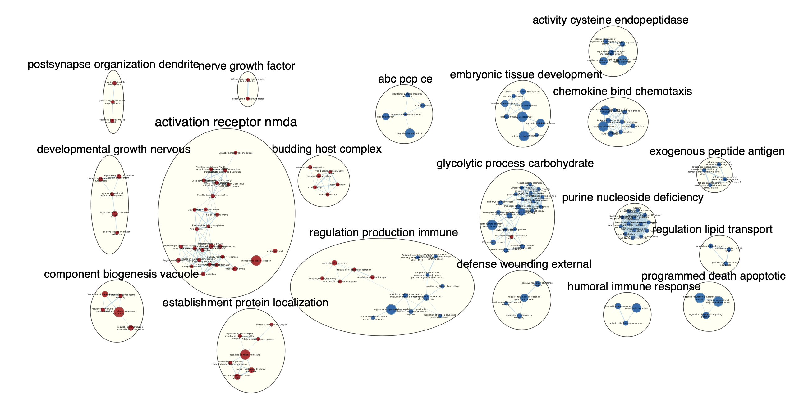

## Introduction

### About the paper
The following details differential gene expression and network analysis of: [Enhanced cortical neural stem cell identity through short SMAD/WNT inhibition in human cerebral organoids facilitates emergence of outer radial glial cells.](https://www.ncbi.nlm.nih.gov/geo/query/acc.cgi?acc=GSE189981)

The authors of this paper investigate a novel culture protocol for 3D Brain Organoids which is thought to enhance the emergence of outer radial glia (oRGs). These cells are a vital component involved in cortical expansions and have been implicated in a variety of neurdevelopmental disorders (NDDs). Feel free to read more here: [Molecular identity of human outer radial glia during cortical development.](https://pubmed.ncbi.nlm.nih.gov/26406371/).

### The data
The data I used ended up being has 33 samples in total which vary by age and culture protocol. The ages are **Day 0** (control, n=3), **Day 30** (n = 30). There are 5 protocols being compared in this study hESC (controls), **Inhibitor Free (IF)**, **WNT inhibition (WNT)**, **Dual SMAD inhibition (Dual)**, and **Triple Inhibition (Triple)**.

Here is a schematic of the data:

### Recap of Assignment 1
In assignment 1, I worked to clean, organize and normalize my data. The data was in an excel file as RPKM and was downloaded from [GEO, accesion number: GSE189981](https://www.ncbi.nlm.nih.gov/geo/query/acc.cgi?acc=GSE189981). the inital bulk sequencing table had multiple column headings denoting the various conditions and cell lines. I cleaned up the headers in that matrix and aligned them with the headers in the sample information table. The genes were already denoted as HGNC, however a few gene symbols were missing. I was able to map 14 additional genes and eliminated 9 unmappable genes. From there, I normalized my data, and verified my normalization with density plots and boxplots. This final, normalized, clean dataframe is my input for this Assignment, alongside a sample information dataframe.

### Recap of Assignment 2
I used the final cleaned dataframe as well as the sample info table from assignment 1 to start assignment 2. Using this data, I first did variance analysis which indicated that I should primarly look at differentiating the organoids by protocol as opposed to age. Based on this, I created a design matrix for my 4 protocols with the iPSC stage being the reference. I then performed differential gene expression analysis with edgeR and fit the results to a general linear model (GLM). I thresholded these results based on FDR < 0.05 and LFC >1 and then proceeded to perform a thresholded over-representation analysis using g:Profiler. I completed 2 analysis workflows. The first is for a total set of genes for all the protocols in comparison to the iPSC stage. This is an organoid level analysis. The second is a unique protocol analysis which allowed me to compare protocol-specific differential expression. This resulted in an output for top overall pathways and top protocol specific pathway. I continue this paradigm here.

### Note on Exclusion
The WNT and IF protocols did not return a significant number of unique pathways (5 positive, 1 negative), so it was excluded from the analysis.


### Load packages
```{r eval=TRUE, message=FALSE, warning=FALSE}
knitr::opts_chunk$set(echo = TRUE)

# Install Bioconductor
if (!requireNamespace("BiocManager", quietly = TRUE)){
  install.packages("BiocManager")}

# Install fgsea
if(! requireNamespace("fgsea")){
  install.packages("fgsea")}

library(fgsea)

```


### Load previous files
```{r eval=TRUE, message=FALSE, warning=FALSE}

# Loading the thresholded analysis files
GO_upregulated <- readRDS("./gsea_inputs/GO_Upregulated.RDS")
GO_downregulated <- readRDS("./gsea_inputs/GO_downregulated.RDS")

# Loading DGE files
dual <- readRDS("./gsea_inputs/Dual.RDS")
IF <- readRDS("./gsea_inputs/IF.rds")
triple <-readRDS("./gsea_inputs/Triple.rds")

# These are the results for all protocols vs iPSCs
all <-readRDS("./gsea_inputs/all.rds")

# Making a protocol list
protocols = list(dual = dual, IF = IF, triple = triple, all = all)
```

## GSEA

### Generate ranked files
```{r eval=TRUE, message=FALSE, warning=FALSE}

for (i in names(protocols)) {
  # Extracting the current df
  working_df <- protocols[[i]]
  
  # Calculating ranks based on logFC and P-value
  rank_df <- data.frame(Name = rownames(working_df), 
                        Rank = sign(working_df$logFC) * -log10(working_df$PValue))
  
  # Ordering the calculated ranks
  rank_df <- rank_df[order(rank_df$Rank),]
  
  ## Making my ranks into a named vector so I can use it with fgsea
  rank_stats <- rank_df$Rank
  names(rank_stats) <- rank_df$Name
  
  # Outputting individual rank and stats object for every protocol
  assign(paste0(i, "_stats"), rank_stats)
  assign(paste0(i, "_rank"), rank_df)
  
  # Removing extras
  rm(working_df, rank_df, rank_stats, i)

}
```

### Download gene set
```{r eval=TRUE, message=FALSE, warning=FALSE}

# Saving my gene set location
gene_set_file <- "Human_GOBP_AllPathways_noPFOCR_no_GO_iea_March_01_2024_symbol.gmt"

# Loading my gene set
gene_set <- gmtPathways(gene_set_file)

```

### Run fgsea gene set

1. I used **fast GSEA** (fgsea) R package version 3.18 for my non-thresholded enrichment analysis. I used the bader lab geneset **"Human_GOBP_AllPathways_noPFOCR_no_GO_iea_March_01_2024_symbol.gmt."** This gene set was published in March 1 2024, has GO biological processes and pathways with no electronic annotation (IEA) and no pathway figure OCR (PFOCR).


```{r eval=TRUE, message=FALSE, warning=FALSE}

# Running fgsea for 3 protocols and all organoids
all_gsea <-fgsea(pathways = gene_set, 
                  stats    = all_stats,
                  minSize  = 15,
                  maxSize  = 700,
                  nperm = 2000)

dual_gsea <-fgsea(pathways = gene_set, 
                  stats    = dual_stats,
                  minSize  = 15,
                  maxSize  = 700,
                  nperm = 2000)

IF_gsea <- fgsea(pathways = gene_set, 
                  stats    = IF_stats,
                  minSize  = 15,
                  maxSize  = 700,
                  nperm = 2000)


triple_gsea <- fgsea(pathways = gene_set, 
                  stats    = triple_stats,
                  minSize  = 15,
                  maxSize  = 700,
                  nperm = 2000)

```
I selected a range of 15 - 700 terms given that important neural processes involve many genes and may be missed in an narrower annotation. Additionally, my later overlapping gene exclusion will ensure any overly large terms will be excluded regardless.

### Reformat fgsea
```{r eval=TRUE, message=FALSE, warning=FALSE}

# Rerformatting code courtesy of Dr Isserlin, to change fgsea output to GSEA output

format_fgsea_results<- function(current_fgsea_results, current_ranks ){
    #calculating the rank at max
    #fgsea returns the leading edge.  Just need to extract the highest rank from 
    ## set to get the rank at max
     calculated_rank_at_max <- apply(current_fgsea_results,1,FUN=function(x){
       max(which(names(current_ranks) %in% unlist(x[8])))})
     #The last column is a comma separated list of genes that are found in the leading edge
    gsea_results <- cbind(current_fgsea_results$pathway,
                                     current_fgsea_results$pathway,
                                     "Details",
                                     current_fgsea_results$size,
                                     current_fgsea_results$ES,
                                     current_fgsea_results$NES,
                                     current_fgsea_results$pval,
                                     current_fgsea_results$padj,
                                     0,
                                     calculated_rank_at_max,
                                     apply(current_fgsea_results,1,
                                           FUN=function(x){paste(unlist(x[8]),collapse=",")}))
    colnames(gsea_results) <-
      c("NAME","description","GSdetails","SIZE","ES","NES","pval","padj","FWER","Rank at Max","leading edge genes")
   return(gsea_results)
      
}
```

```{r eval=TRUE, message=FALSE, warning=FALSE}

# Reformatting all my GSEA results
dual_gsea = as.data.frame(format_fgsea_results(dual_gsea,dual_stats))
all_gsea = as.data.frame(format_fgsea_results(all_gsea,all_stats))
IF_gsea = as.data.frame(format_fgsea_results(IF_gsea,IF_stats))
triple_gsea = as.data.frame(format_fgsea_results(triple_gsea,triple_stats))

# Storing my total number of pathways between 15 and 700
total_pathways <- length(gene_set[which(sapply(gene_set, length) > 14 & sapply(gene_set, length) < 701)])
```

### Positives and Negatives
```{r eval=TRUE, message=FALSE, warning=FALSE}

# Parsing out my positive and negative genes based on normalized enrichment score (NES) 
# Also filtering for significance 
# for dual
dual_gsea_pos <- dual_gsea[which(dual_gsea$NES >0 & dual_gsea$padj < 0.05),]
dual_gsea_neg <- dual_gsea[which(dual_gsea$NES <0 & dual_gsea$padj < 0.05),]

# for triple
triple_gsea_pos <- triple_gsea[which(triple_gsea$NES >0 & triple_gsea$padj < 0.05),]
triple_gsea_neg <- triple_gsea[which(triple_gsea$NES <0 & triple_gsea$padj < 0.05),]

# for IF
IF_gsea_pos <- IF_gsea[which(IF_gsea$NES >0 & IF_gsea$padj < 0.05),]
IF_gsea_neg <- IF_gsea[which(IF_gsea$NES <0 & IF_gsea$padj < 0.05),]

# for all
all_gsea_pos <- all_gsea[which(all_gsea$NES >0 & all_gsea$padj < 0.05),]
all_gsea_neg <- all_gsea[which(all_gsea$NES <0 & all_gsea$padj < 0.05),]

```

### fgsea Summary

There are **```r total_pathways```** total gene sets with 15 to 700 terms
```{r eval=TRUE, message=FALSE, warning=FALSE}

# Summary stat table which gives me the number of genes pre and post filtration for every protocol
summary_stats <- data.frame(Dual = c(nrow(dual_gsea[which(dual_gsea$NES >0),]),
                                     nrow(dual_gsea[which(dual_gsea$NES <0),]),
                                     nrow(dual_gsea_pos),
                                     nrow(dual_gsea_neg)),
                            Triple = c(nrow(triple_gsea[which(triple_gsea$NES >0),]),
                                       nrow(triple_gsea[which(triple_gsea$NES <0),]),
                                       nrow(triple_gsea_pos),
                                       nrow(triple_gsea_neg)),
                            IF = c(nrow(IF_gsea[which(IF_gsea$NES >0),]),
                                   nrow(IF_gsea[which(IF_gsea$NES <0),]),
                                   nrow(IF_gsea_pos),
                                   nrow(IF_gsea_neg)),
                            all = c(nrow(all_gsea[which(all_gsea$NES >0),]),
                                    nrow(all_gsea[which(all_gsea$NES <0),]),
                                    nrow(all_gsea_pos),
                                    nrow(all_gsea_neg)), 
                            row.names = c("Positive NES","Negative NES","Positive NES, FDR < 0.05","Negative NES, FDR < 0.05"))

kableExtra::kable_styling(knitr::kable(summary_stats,
                                       caption = paste("Summary: There are",total_pathways,"total gene sets
                                                       between 15 and 700 terms, subsets for each
                                                       protocl are shown below",sep =" "),
                                       font_size = 10))

```

### fgsea Top positive and negative pathway 
```{r eval=TRUE, message=FALSE, warning=FALSE}

# Positive summary table which gives me the number of genes pre and post filtration for every protocol
positive_summary_table <- data.frame(dual = dual_gsea_pos$NAME[1:10],
                                     Triple = triple_gsea_pos$NAME[1:10],
                                     IF = IF_gsea_pos$NAME[1:10],
                                     all = all_gsea_pos$NAME[1:10])

negative_summary_table <- data.frame(dual = dual_gsea_neg$NAME[1:10],
                                     Triple = triple_gsea_neg$NAME[1:10],
                                     IF = IF_gsea_neg$NAME[1:10],
                                     all = all_gsea_neg$NAME[1:10])

kableExtra::kable_styling(knitr::kable(positive_summary_table,
                                       caption = "Summary: Top positive pathways by protocol"),
                          font_size = 10)

kableExtra::kable_styling(knitr::kable(negative_summary_table,
                                       caption = "Summary: Top negative pathways by protocol"),
                          font_size = 10)
```


### Unique positive fgsea filters
```{r eval=TRUE, message=FALSE, warning=FALSE}

# using set operations to get unique positive genes for each protocol
# non for all because it's a combined analysis
# for dual
unique_dual_names_pos = setdiff(dual_gsea_pos$NAME,
                      union(triple_gsea_pos$NAME,
                            union(IF_gsea_pos$NAME,
                                  all_gsea_pos$NAME)))
unique_dual_pos <- dual_gsea_pos[dual_gsea_pos$NAME %in% unique_dual_names_pos, ]

# for triple
unique_triple_names_pos = setdiff(triple_gsea_pos$NAME,
                                  union(dual_gsea_pos$NAME,
                                        union(IF_gsea_pos$NAME,
                                              all_gsea_pos$NAME)))
unique_triple_pos <- triple_gsea_pos[triple_gsea_pos$NAME %in% unique_triple_names_pos, ]

# for IF
unique_IF_names_pos = setdiff(IF_gsea_pos$NAME,
                      union(dual_gsea_pos$NAME,
                            union(triple_gsea_pos$NAME,
                                  all_gsea_pos$NAME)))
unique_IF_pos <- IF_gsea_pos[IF_gsea_pos$NAME %in% unique_IF_names_pos, ]

```

### Unique negative fgsea filters
```{r eval=TRUE, message=FALSE, warning=FALSE}

# using set operations to get unique negative genes for each protocol
# non for all because it's a combined analysis
# for dual
unique_dual_names_neg = setdiff(dual_gsea_neg$NAME,
                      union(triple_gsea_neg$NAME,
                            union(IF_gsea_neg$NAME,
                                  all_gsea_neg$NAME)))
unique_dual_neg <- dual_gsea_neg[dual_gsea_neg$NAME %in% unique_dual_names_neg, ]

# for triple
unique_triple_names_neg = setdiff(triple_gsea_neg$NAME,
                      union(dual_gsea_neg$NAME,
                            union(IF_gsea_neg$NAME,
                                  all_gsea_neg$NAME)))
unique_triple_neg <- triple_gsea_neg[triple_gsea_neg$NAME %in% unique_triple_names_neg, ]

# for IF
unique_IF_names_neg = setdiff(IF_gsea_neg$NAME,
                      union(dual_gsea_neg$NAME,
                            union(triple_gsea_neg$NAME,
                                  all_gsea_neg$NAME)))
unique_IF_neg <- IF_gsea_neg[IF_gsea_neg$NAME %in% unique_IF_names_neg, ]
  
```

### Unique fgsea Summary and gProfiler comparison 
```{r eval=TRUE, message=FALSE, warning=FALSE}

# Table displaying a summary of positive and unqiue pathways
unique_pos_summary_table <- data.frame(dual = unique_dual_pos$NAME[1:15],
                                     IF = unique_IF_pos$NAME[1:15],
                                     Triple = unique_triple_pos$NAME[1:15])

# Table displaying a summary of negative and unqiue pathways
unique_neg_summary_table <- data.frame(dual = unique_dual_neg$NAME[1:15],
                                     IF = unique_IF_neg$NAME[1:15],
                                     Triple = unique_triple_neg$NAME[1:15])


# Comparison with tables pulled from gProfiler analysis in assignment 2
kableExtra::kable_styling(knitr::kable(unique_pos_summary_table,
                                       caption = "Top unique positive pathways (GSEA)"),
                          font_size = 10)

kableExtra::kable_styling(knitr::kable(GO_upregulated[1:15,1:3],
                                       caption = "Top unique positive pathways (gProfiler)"),
                          font_size = 10)


kableExtra::kable_styling(knitr::kable(unique_neg_summary_table,
                                       caption = "Top unique negative pathways (GSEA)"),
                          font_size = 10)

kableExtra::kable_styling(knitr::kable(GO_downregulated[1:15,1:3],
                                       caption = "Top unique negative pathways (gProfiler)"),
                          font_size = 10)
```

3. In comparison to my gProfiler results, my GSEA results are incredibly different. There are no matching terms across any of the protocols or matching themes. This is after double checking the analysis was done correctly. This is not a striaghtforward comparison, likely because of the gene annotation sets used were different. In assignment 2 we used gProfilers built in annotation sets and many results specifically outputted as GO biological processes. However, in this GSEA assignment we used an up to date Bader lab gene set with many pathway, disorder and process annotations. As such the GSEA results are much more varied as opposed to the very direct results from gProfiler. The second reason why this isn't straightforward is because, by it's nature, the non-thresholded analysis will pick up many more genes and give you much higher diversity in results. This is in contrast to non-thresholded analysis with gProfiler which focuses on differential expressed genes which might group into similar themes.


## Cytoscape & EnrichmentMap

### Initial Network

1. Based on network analyzer in cytoscape, the initial networks had the following edges and nodes:
```{r}

# Table of nodes and edges data
nodes_edges <- data.frame(`Neural Organoids` = c("307","1914"),
                                     Dual = c("29","36"),
                                     Triple = c("260","432"),row.names = c("Nodes","Edges"))

kableExtra::kable_minimal(knitr::kable(nodes_edges,
                                       caption = "Nodes and Edges Summary"))
```

All maps were created using **P-value < 0.05** and **FDR/Q-value < 0.05**.

**Neural Organoid initial network**

Figure 1A: Neural organoid initial network with 307 nodes and 1914 edges.


**Dual initial network**

Figure 1B: Dual inhibition initial network with 29 nodes and 36 edges.


**Triple initial network**

Figure 1C: Triple inhibition initial network with 260 nodes and 432 edges.


### Autoannotated Network

2. Network was autoannotated with the autoannotate app on cytoscape. The following parameters were used:

```{r}

# Table of nodes and edges data
annotate_params <- data.frame(`Parameter` = c("Wordcloud: Adjacent Word (default)","3","1","8","TRUE"),
                          row.names =c("Label Algorithm:","Max words per label:","Minimum word occurrence:","Adjacent word bonus:","Layout network to prevent cluster overlap:"))

kableExtra::kable_minimal(knitr::kable(annotate_params ,
                                       caption = "Autoannotate parameters"))
```


**Neural Organoid autoannotated network**

Figure 2A: Neural Organoid autoannotated network


**Dual autoannotated network**

Figure 2B: Dual inhibition autoannotated network.


**Triple autoannotated network**

Figure 2C: Triple inhibition autoannotated network.


### Publication Ready Figure

3. Publication Ready Figures created with enrichment score legend and condition labels.

**Neural Organoid publication ready figure**

Figure 3A: Neural organoids publication ready network.


**Dual publication ready figure**

Figure 3B: Dual inhibition publication ready network.


**Triple publication ready figure**

Figure 3C: Triple inhibition publication ready network.


### Collapsed Summary Network

4. Networks were collapsed in to theme networks using the summary network features.

**Neural Organoid summary network**

The neural organoid summary network had main upregulated networks related to: *WNT signaliing*, *positive development neurogenesis (PDN)*, *anatomical morphogenesis neuron (AMN)*, *modulation of excitatory potential (MEP)* and *microtubule processes*. This fits with the model for several reasons. The PDN, AMN and and MEP networks are expected in a neural organoid given that they are standard aspects of neurodevelopment.  WNT signalling is likely active in many aspects of development in a non-neural specifi way, but it is also well documented in brain development. Microtubule processes are more broad, however, studies have shown that cytoskeletal reorganization plays an important role in neural differentiation and lineage commitment. 

The downregulated genes appear to relate to *immune function* and cell division (*post-mitotic degradation*, *sister chromatid segregation*, *atr replication stress*). Immune function is interesting because studies have shown that immune activation during neurodevelopment can be damaging. It is reasonable such processes would be downregulated. The downregulation of mitotic activity is an observed phenomenon which occurs at some stages of neurodevelopment. It is hypothesized that this downregulation enables cytoskeletal processes to act on neuronal growth and extension instead.  


Figure 4A: Neural Organoid summary network.


**Dual summary network**

The dual inhibition results are more puzzling. This is given that this network excludes all common neurdevelopment networks with other protocols. The downregulationg of *positive immune response* may be expected given the previous logic relating to immune activing during the brain. However, negative regulation of cell differentiation might hunt that the dual inhibited organoids are in a more progenitor stage and don't differentiate as readily. Additionally, the eye development node may indicate non-commitment to a brain neural lineage. This could support the lack of differentiation.


Figure 4B: Dual inhibition summary network.


**Triple summary network**

The triple network has some interesting nodes which differentiate it from other protocols. A lot of the positive nodes such as *dendrite organization*, *nervous growth* and *nerve growth factor* might indicate that these organoids have more mature phenotype which is undergoing more neurogenesis. This is in comparison to Dual inhibition which seemed to be in a more progenitor  stage. Meanwhile *budding host complex*, *glutamate release cycle* and *activation nmda*, are all nodes relating to excitatory potential. These two facts combined may indicate that these organoids are differentiating, forming synapses and using neurotransmitters. Interestingly, there was many negatively regulated nodes related to metabolism such as *glycolytic carbohydrates*, *regulation of lipid transport* and *purine nucleoside deficiency*. Although this is not well characterized, some studies have shown that stem cells have differing and sometimes higher metabolic than neurons. Overall, many of the negative nodes are uncharacterized and maybe me goodareas of novel investigation.


Figure 4C: Triple inhibition summary network.


## Interpretation

### Original paper
My conclusion in assignment 2 was that yes, the thresholded analysis does yield some similarity to the paper. This is because. there was an alignment between the heterogeneity in organoids and WNT/Notch signaling. The GSEA non-thresholded analysis does seem to corroborate the overall issue with organoid stochasticity. There was no clear delineation or pathways immediately obvious from the data which might indicate that even dual and triple inhibition protocols are fairly unguided and involve plenty of self assembly. However, as noted in a previous section, my thresholded and non-thresholded analyses were quite different with no direct comparisons.

One insight that does corroborate information from the paper is the observation that triple inhibited organoids may be in a more in a more developed state. In the original paper, these organoids highly expressed genes for the neocortex and medial pallium while not expressing as many genes for neural stem cells. Alternatively, the paper showed that the dual inhibition protocol had much higher neural stem cell gene expression and much lower regional (ex neocortex, pallium) expression. These insights could line up with our observations that triple-i nodes were more focused on specified neural action while dual-i nodes were more stem like.

More broadly, the combined protocol all neural organoid analysis does corroborate well with the paper. The developing neural organoids, which rely heavily on modulaitng cytoarchitectural features, did have upregulation of cytoskeletal and microtubule processes in my analysis.

### Publications
There is some evidence supporting my observed results. Firstly, the observation that the triple-i protocol might be more differentiated than the dual-i protocol does line up with previous observations regarding their use. Triple-i protocols are directed at outer radial glia (oRGs) which are bonafide neural precursors that generate the majority of the neural growth and diversity. As such, my results showing the differentiation of the triple-i organoids could tie into that function. Meanwhile dual protocols which are less differentiated much more closely resemble ventral radial glia (vRG) which are also neurogenic but to a lesser extent.

Additionally, observations around the important of cytoskeletal and microtubule signalling in organoid formation are corroborated. Multiple studies have shown that neural precursors found in organoids may rely on cytoskeletal signalling to establish a niche. Similarly, these cytoskeletal regulation genes may be important for cell fate and decision making during development. 

## Post Analysis
I performed a post-analysis using the bader lab transcription factor (TF) gene set. I specifically looked for TFs which are either 1. of interest in oRG biology during neurodevelopment. 2. linked with neurodevelopmental disorders. I used a Mann-Whitney test thresholded at p-value < 0.05

I found that FOXG1, which is an important marker for telencephalon development was  linked with several upregulated nodes including neural prjection. Meanwhile FOXO1, which is an important regultor of neurodevelopment was also linked with neuronal morphogenesis, neurogenesis and synapse formation. Knockouts of FOXO TFs have shown to cause several disease phenotypes such as degeneration.  Unfortunately, neither of those genes were picked up in the unique analysis, likely due to to it's limited nature.

Surprisingly, I did not find a strong link between the any analysis and PAX6, which is a strong regulator of neural precursor. It only somewhat interacted with microtubule processes and proteasome degradation. The triple-i protocol had some links with NKX2.5, which is thought to be the upstream TF controlling HOPX expression. Whereby HOPX is known to be the most established marker of oRGs. This may support the role of the triple-i protocol in oRG generation.


### Transcription Factor Signature set

**Neural Organoid transcription factor post-analysis network**


**Dual transcription factor post-analysis network**


**Triple transcription factor post-analysis network**


## Question Quicklinks

[GSEA info Q1](#run-fgsea-gene-set)

[fgsea Summary Q2](#fgsea-summary)

[Summary Enrichment Comparison Q3](#unique-fgsea-summary-and-gprofiler-comparison)


[Initial Enrichment Maps Q1](#initial-network)

[Annotation Q2](#autoannotated-network)

[Publication ready figure Q3](#publication-ready-figure)

[Network Collapse Q4](#collapsed-summary-network)


[Interpretation for Original paper Q1](#original-paper)

[Interpretation for literature Q2](#publications)


[Post Analysis Q1](#post-analysis) 


## References
1.	Rosebrock D, Arora S, Mutukula N, Volkman R, Gralinska E, Balaskas A, et al. Enhanced cortical neural stem cell identity through short SMAD and WNT inhibition in human cerebral organoids facilitates emergence of outer radial glial cells. Nat Cell Biol. 2022;24(6):981–95. 

2.	Pollen AA, Nowakowski TJ, Chen J, Retallack H, Sandoval-Espinosa C, Nicholas CR, et al. Molecular Identity of Human Outer Radial Glia During Cortical Development. Cell. 2015 Sep 24;163(1):55–67. 

3.	Kriegstein A, Noctor S, Martínez-Cerdeño V. Patterns of neural stem and progenitor cell division may underlie evolutionary cortical expansion. Nat Rev Neurosci. 2006 Nov;7(11):883–90. 

4.	Huber W, Carey VJ, Gentleman R, Anders S, Carlson M, Carvalho BS, et al. Orchestrating high-throughput genomic analysis with Bioconductor. Nat Methods. 2015 Feb;12(2):115–21. 

5.	Robinson MD, McCarthy DJ, Smyth GK. edgeR: a Bioconductor package for differential expression analysis of digital gene expression data. Bioinformatics. 2010 Jan 1;26(1):139–40. 

6. Korotkevich G, Sukhov V, Sergushichev A (2019). “Fast gene set enrichment analysis.” bioRxiv. 

7. Shannon P, Markiel A, Ozier O, Baliga NS, Wang JT, Ramage D, et al. Cytoscape: a software environment for integrated models of biomolecular interaction networks. Genome research. 2003;13(11):2498–504.

8. Merico D, Isserlin R, Stueker O, Emili A, Bader GD (2010) Enrichment Map: A Network-Based Method for Gene-Set Enrichment Visualization and Interpretation. PLoS ONE 5(11): e13984. https://doi.org/10.1371/journal.pone.0013984

9. Kucera M, Isserlin R, Arkhangorodsky A, Bader GD. AutoAnnotate: A Cytoscape app for summarizing networks with semantic annotations. F1000Res. 2016 Jul 15;5:1717.

10. Oesper, L., Merico, D., Isserlin, R., & Bader, G. D. (2011). WordCloud: a Cytoscape plugin to create a visual semantic summary of networks. Source Code for Biology and Medicine, 6(1), 7.

11. Assenov Y, Ramírez F, Schelhorn SE, Lengauer T, Albrecht M. Computing topological parameters of biological networks. Bioinformatics. 2008 Jan 15;24(2):282-4. doi: 10.1093/bioinformatics/btm554. Epub 2007 Nov 15. PMID: 18006545.

12. Utriainen, M., Morris, J.H. clusterMaker2: a major update to clusterMaker, a multi-algorithm clustering app for Cytoscape. BMC Bioinformatics 24, 134 (2023). 

13.	Kolberg L, Raudvere U, Kuzmin I, Adler P, Vilo J, Peterson H. g:Profiler-interoperable web service for functional enrichment analysis and gene identifier mapping (2023 update). Nucleic Acids Res. 2023 Jul 5;51(W1):W207–12. 
 Methods. 2015;12(2):115–121. 

14. Faissner A, Reinhard J. The extracellular matrix compartment of neural stem and glial progenitor cells. Glia. 2015 Aug;63(8):1330-49. doi: 10.1002/glia.22839. Epub 2015 Apr 22. PMID: 25913849.

15. Monet, M. C., & Quan, N. (2023). Complex Neuroimmune Involvement in Neurodevelopment: A Mini-Review. Journal of Inflammation Research, 16, 2979–2991.

16. Jády AG, Nagy ÁM, Kőhidi T, Ferenczi S, Tretter L, Madarász E. Differentiation-Dependent Energy Production and Metabolite Utilization: A Comparative Study on Neural Stem Cells, Neurons, and Astrocytes. Stem Cells Dev. 2016 Jul 1;25(13):995-1005.

17. Kawaguchi A (2021) Neuronal Delamination and Outer Radial Glia Generation in Neocortical Development. Front. Cell Dev. Biol. 8:623573.

18. Miranda-Negrón Y and García-Arrarás JE (2022) Radial glia and radial glia-like cells: Their role in neurogenesis and regeneration. Front. Neurosci. 16:1006037.

19. Hettige NC, Ernst C. FOXG1 Dose in Brain Development. Front Pediatr. 2019 Nov 22;7:482. 

20. Santo EE, Paik J. FOXO in Neural Cells and Diseases of the Nervous System. Curr Top Dev Biol. 2018;127:105-118.

21. Götz M, Stoykova A, Gruss P. Pax6 controls radial glia differentiation in the cerebral cortex. Neuron. 1998 Nov;21(5):1031-44. 

22. Uhlén M et al., Tissue-based map of the human proteome. Science (2015)
PubMed: 25613900 DOI: 10.1126/science.1260419 

23. Caspa Gokulan R, Yap LF, Paterson IC. HOPX: A Unique Homeodomain Protein in Development and Tumor Suppression. Cancers (Basel). 2022 Jun 2;14(11):2764.

24. Kochinke K, Zweier C, Nijhof B, Fenckova M, Cizek P, Honti F, Keerthikumar S, Oortveld MA, Kleefstra T, Kramer JM, Webber C, Huynen MA, Schenck A. Systematic Phenomics Analysis Deconvolutes Genes Mutated in Intellectual Disability into Biologically Coherent Modules. Am J Hum Genet. 2016 Jan 7;98(1):149-64. doi: 10.1016/j.ajhg.2015.11.024. PMID: 26748517; PMCID: PMC4716705.
